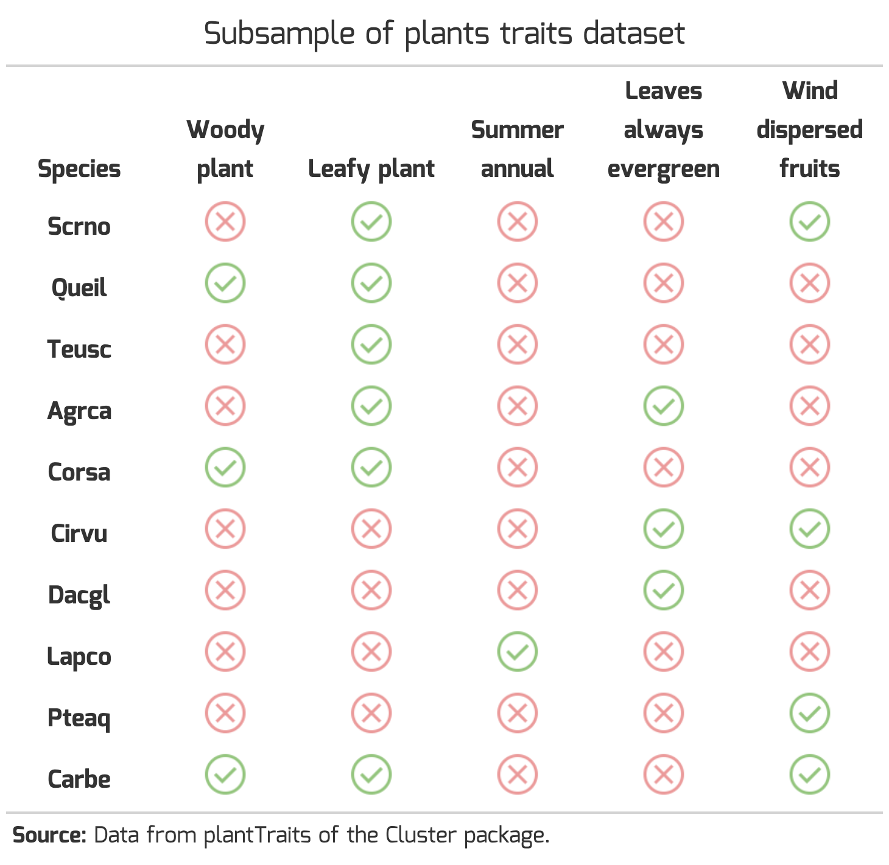
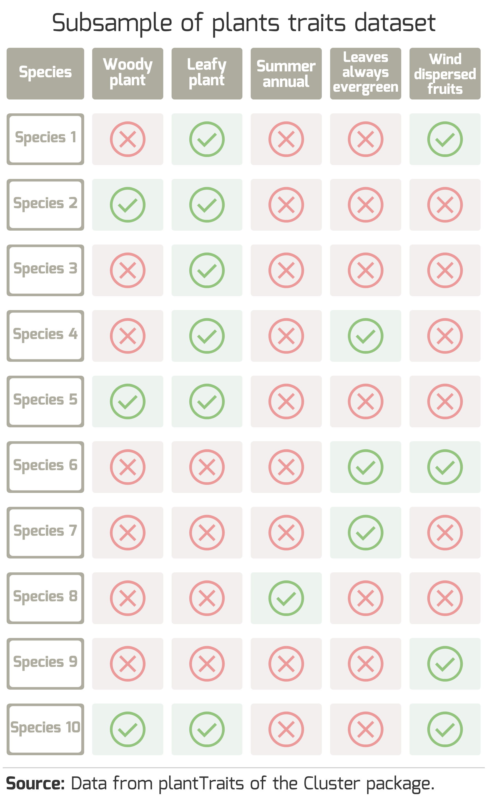

Pretty tables
================
2023-01-18

<style type="text/css">
body{
font: 14px "Mina", sans-serif;
}
</style>

This is a short practice on making pretty tables using the gt package
with icons that can be downloaded and lightly edited with the Magick
package or customized in illustrator. Additionally, we can also do a
simple shiny app to make tables with a given icon for every cell in a
table.

------------------------------------------------------------------------

<br />

## Example of icons inside the table

Using a test data set with binary data like the plants traits data set
from the cluster package.

- Sample 10 observations and five traits

``` r
data0 <- cluster::plantTraits %>% 
  sample_n(10) %>% 
  select(lign, leafy, suman, everalw, windgl) 
```

<br />

Could use library Icons but would prefer to use google icons
(<https://fonts.google.com/icons>) and this is not working
(<https://github.com/mitchelloharawild/icons/issues/70>). So picked the
icons on the website and use R to download them.

- Prepare table with download links and saving path to extract icons.
  Save icons with matching name with data.

``` r
dir.create(here('elements'), showWarnings = FALSE)
urls <- 'https://fonts.gstatic.com/s/i/short-term/release/materialsymbolsoutlined/'

icons <- data.frame(urls=paste0(urls, c("check_circle","cancel"),"/default/48px.svg"),
                    svgs = here('elements', paste0(c("1","0"),".svg")),
                    code = c("Present","Absent"))

walk2(icons$urls, icons$svgs, safely(~ download.file(.x , .y, mode = "wb")))
```

<br />

- Edit icons to have different colors with the package Magick, and to
  make an empty icon for missing data.

``` r
present <- image_colorize(image_read_svg(icons$svgs[1]), 100, '#93c47d')
absent <- image_colorize(image_read_svg(icons$svgs[2]), 100, '#EA9999')

image_write(present,  path = icons$svgs[1], format = "svg")

image_write(absent, path = icons$svgs[2], format = "svg")

image_write(image_colorize(present, 100, 'white'), 
            path = here('elements',"NA.svg"), format = "svg")

## show colored icons
image_append(c(present, absent))
```

<br />

- Replace the data by the icons paths.

``` r
icons <- data.frame(icons = list.files(here('elements'), full.names = TRUE, pattern = '.svg')) %>%
  mutate(value = basename(tools::file_path_sans_ext(icons)))

data <- data0 %>% 
  rownames_to_column('Species') %>% 
  pivot_longer(-Species, values_ptypes = as.character()) %>% 
  replace_na(list(value = "NA")) %>% 
  left_join(icons, by = 'value') %>% 
  select(-value) %>% 
  pivot_wider(names_from = name, values_from = icons)
```

<br />

- Use the gt package to include icons while making table.

``` r
qr <- gt(data) %>% 
  tab_header(
    title = md("Subsample of plants traits dataset")) %>% 
  opt_table_font(font = list(google_font("Mina"), default_fonts())) %>% 
  cols_label(lign = 'Woody plant', leafy = 'Leafy plant', 
             suman = 'Summer annual',everalw = 'Leaves always evergreen',
             windgl = 'Wind dispersed fruits') %>%  
  text_transform(locations = cells_body(columns = 2:ncol(data), 
                                        rows = everything()),
                 fn = function(x) { map_chr(x, ~ local_image(filename = .x,
                                                             height = 40))}) %>%
  tab_source_note(
    source_note = 
      md("**Source:** Data from plantTraits of the Cluster package.")) %>% 
  cols_align(
    align = "center",
    columns = everything()) %>%
  cols_width(everything() ~ px(120))  %>%
  tab_style(style = list(cell_text(weight = "bold")),
            locations = list(cells_body(columns = Species, 
                                        rows = everything()),
                             cells_column_labels(columns = everything()))) %>% 
  tab_options(data_row.padding = px(0),
              data_row.padding.horizontal = px(0),
              table.font.size = px(20),
              heading.align = 'center',
              table.border.top.style = "hidden",
              table.border.bottom.style = "hidden",
              table_body.hlines.style = "hidden",
              table.background.color = "#FFFFFF00")
gtsave(qr, "figures/fig1.png")


```


<br />

This Rmarkdown is both being knit as an html and for github, and since
for the latter this doesn’t render the image with gt but lines of html
code it’s then easier to save the image and then show the locally saved
image.

------------------------------------------------------------------------

<br />

## Example of table with all elements as icons

- Make customized images for each element in illustrator
  (elementsToExport.ai). Name the files differently depending if these
  are column names, row names or content.

- Replacing all elements as icons requires some data wrangling given the
  transforming function doesn’t work for column names

``` r
icons <- data.frame(icons = list.files(here('elements'), full.names = TRUE, 
                                       pattern = '.svg')) %>%
  mutate(columns = basename(tools::file_path_sans_ext(icons))) %>% 
  filter(str_detect(columns, "_")) %>% 
  separate(columns, into = c("column","content"), sep = "_", extra = "drop")

# prepare column header
colData <- data.frame(content = c('Species',colnames(data0))) %>% 
  left_join(filter(icons, column %in% 'header'), by = "content") %>% 
  pivot_wider(names_from = content, values_from = icons) %>% 
  select(-column)

# prepare row header
rowData <- data.frame(content = as.character(seq(1:nrow(data0)))) %>% 
  left_join(filter(icons, column %in% 'Species'), by = "content") %>% 
  rename(Species = icons) %>% 
  select(-column, -content)

# prepare content
data1 <- data0 %>% 
  mutate(row = row_number()) %>% 
  pivot_longer(cols = -row, names_to = "column", values_to = "content",
               values_ptypes = as.character()) %>% 
  replace_na(list(content = "NA")) %>% 
  left_join(select(filter(icons, column %in% 'content'),-column), 
            by = 'content') %>% 
  pivot_wider(id_cols = row, names_from = column, values_from = icons) %>% 
  select(-row)

dataIcons <- colData %>% 
  bind_rows(cbind(rowData, data1))
```

<br />

- Use the gt package to include icons while making table.

``` r
qr2 <- gt(dataIcons) %>% 
  tab_header(
    title = md("Subsample of plants traits dataset")) %>% 
  opt_table_font(font = list(google_font("Mina"), default_fonts())) %>% 
  text_transform(locations = cells_body(columns = everything(), 
                                        rows = everything()),
                 fn = function(x) { map_chr(x, ~ local_image(filename = .x,
                                                             height = 100))}) %>%
  tab_source_note(
    source_note = 
      md("**Source:** Data from plantTraits of the Cluster package.")) %>% 
  cols_align(
    align = "center",
    columns = everything()) %>%
  tab_options(
    data_row.padding = px(0),
            data_row.padding.horizontal = px(4),
              table.font.size = px(35),
              heading.align = 'center',
              column_labels.hidden = TRUE, ## remove header without icons paths
              table.border.top.style = "hidden",
              table.border.bottom.style = "hidden",
              table_body.hlines.style = "hidden") 
gtsave(qr2, "figures/fig2.png")


```


<br />

The gt approach to include images in a table still could be better
because it’s hard to adjust the height of the elements in a way the
data_row padding is not too weird. The proportions of the icons dictates
the padding given the height provided to the local_image function.

------------------------------------------------------------------------

<br />

## Example of a shiny table to replace every cell for a given customized icon

A major limitation of shiny is how to share the app without having to
deploy it in shinyapps.io or without having to install the same R
package versions to run it. For a workaround of this problem we can use
binder that will open the app in a similar environment it was developed.

The shiny app is in the
[shiny_app](https://github.com/acafonsosilva/R_tables_graphicExamples/blob/main/shiny_app/app.R)
folder. It can be run with the following code assuming the environment
has all the required packages

``` r
library(shiny)
shinyAppDir(
  here("shiny_app"),
  options = list(height = 900)
)
```

------------------------------------------------------------------------

### Shiny app code

``` r
library(tidyverse)
library(here)
library(gt)
library(shiny)
library(shinyFiles)

ui <- fluidPage(
  titlePanel("Producing pretty tables with icons"),
  
  # Sidebar with two input widgets
  sidebarLayout(
    sidebarPanel(
      
      p("1. Select folder with design elements from illustrator"),
      p(""),
      shinyDirButton(id = "iconsFolder", label = "Select icons",
                     title = "Select directory with icons"), ### to add Icons
      p(""),
      p("2. Upload data file in csv format"),
      fileInput(inputId = "dataset",
                label = "Find file", accept = c(".csv")),       ### to add dataset
      p("3. Type height of the icons in pixels"), 
      numericInput("iconHeight", "Height", value = 30),
      br(),
      br(),
      br(),
      p("4. Export table as pdf"), 
      downloadButton("download", "table.pdf"),
      p("Exporting function doesn't export as the html version.\nIncrease icon height until row padding is more suitable.")),      
    
    mainPanel(
      h5("\nListed icons"), 
      gt_output("icons"),
      h5("Raw table"), 
      tableOutput("table0"),
      br(),
      h5("\nPretty table"), 
      gt_output(outputId = "Table"),
      p("\n")
    ) 
  ),
)

server <- function(input, output, session){
  ## select folder with design elements
  volumes = c(wd=here())
  
  shinyDirChoose(input, 'iconsFolder', roots = volumes, 
                 filetypes = 'svg')
  
  icons0 <- reactive({
    data.frame(icons = list.files(parseDirPath(volumes, input$iconsFolder), 
                                         pattern = "svg", full.names = TRUE)) %>%
      mutate(columns = basename(tools::file_path_sans_ext(icons))) %>%
      filter(str_detect(columns, "_")) %>%
      separate(columns, into = c("column","content"), sep = "_", extra = "drop",
               remove = TRUE, fill = 'left')
    })
  
  output$icons <- render_gt(height = px(200),{
    gt(icons0()) %>%
      text_transform(locations = cells_body(columns = icons, rows = everything()),
                     fn = function(x) { map_chr(x, ~ local_image(filename = .x,
                                                                 height = input$iconHeight))})   ### <-
    
  })
  
  ## read data input file and makes it a reactive element
  input_dataset <- reactive({
    req(input$dataset)   ### <-
    read.csv(input$dataset$datapath, 
             na.strings = "NA",
             colClasses = "character")
  })
  
  output$table0 <- renderTable(input_dataset())
    
  tableOut <- reactive({
    if (is.null(input_dataset)) {
      return(NULL)}
    
    icons <- icons0() 
    data0 <- input_dataset() 
    
    rowHeader <- icons %>% 
      filter(!column %in% c('content','header')) %>% 
      pull(column) %>% 
      unique()
    
   if(length(rowHeader) == 1){ # make sure there are icons for only one row header

      # prepare column header
      colData <- data.frame(content = colnames(data0)) %>%
        left_join(filter(icons, column %in% 'header'), by = "content") %>%
        pivot_wider(names_from = content, values_from = icons) %>%
        select(-column)
  
      # prepare row header
      rowData <- data.frame(content = pull(select(data0, !!as.symbol(rowHeader)))) %>%
        left_join(filter(icons, column %in% rowHeader), by = "content") %>%
        rename(!!rowHeader := "icons") %>%
        select(-column, -content)

      # prepare content
      data1 <- data0 %>%
        select(-!!as.symbol(rowHeader)) %>%
        mutate(row = row_number()) %>%
        pivot_longer(cols = -row, names_to = "column", values_to = "content",
                     values_ptypes = as.character()) %>%
        replace_na(list(content = "NA")) %>%
        left_join(select(filter(icons, column %in% 'content'),-column),
                  by = 'content') %>%
        pivot_wider(id_cols = row, names_from = column, values_from = icons) %>%
        select(-row)

      dataIcons <- colData %>%
        bind_rows(cbind(rowData, data1))

      
   gt(dataIcons) %>%
     opt_table_font(font = list(google_font("Mina"), default_fonts())) %>%
     text_transform(locations = cells_body(columns = everything(), rows = everything()),
                    fn = function(x) { map_chr(x, ~ local_image(filename = .x,
                                                                height = input$iconHeight))}) %>%  ### <-
     tab_style(
       style = "padding:0px;",
       locations = cells_body(columns = everything(), rows = everything())
     ) %>%
     tab_options(column_labels.hidden = TRUE, ## remove header without icons paths
                 table.border.top.style = "hidden",
                 table.border.bottom.style = "hidden",
                 table_body.hlines.style = "hidden")
   }
  })
  
  output$Table <- render_gt({
    tableOut()
  })
  
  output$download <- downloadHandler(
    filename = function() {
      here("table.pdf")
    } ,
    content = function(file1) {
      gtsave(tableOut(), file1, vwidth = input$iconHeight*(nrow(input_dataset())/2)) #, vheight = input$iconHeight*0.1 <- doesn't do anything
    }
  )
}

# Run the application 
shinyApp(ui = ui, server = server, options = list(port=4184))
```


